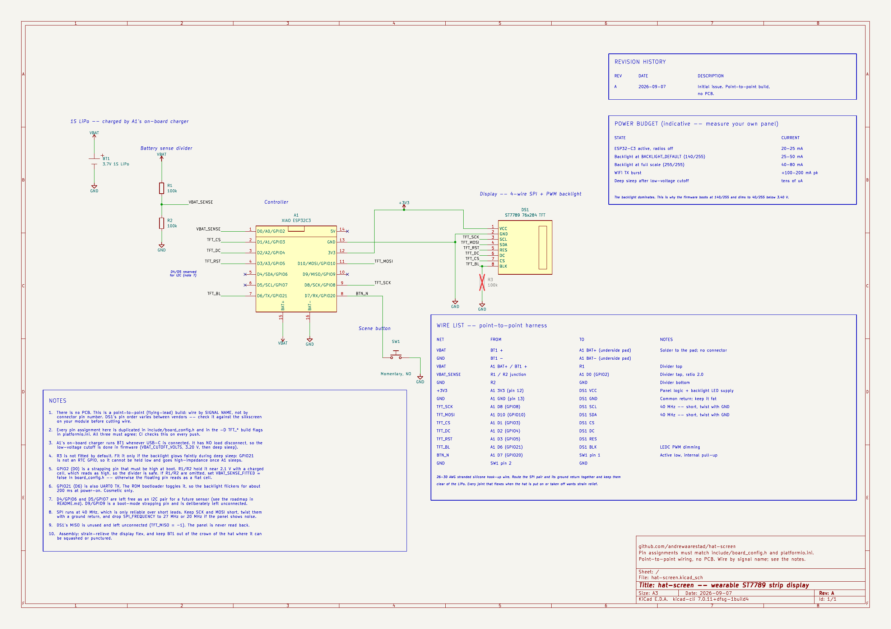

# Schematic



[Printable PDF](hat-screen.pdf) · [KiCad source](hat-screen.kicad_sch)

There is no PCB in this project and there is not going to be one — the hat is
wired point to point. The schematic still earns its place: it is the one
drawing that says what is connected to what, why each pin was chosen, and
which parts are optional. The wiring table on the sheet is what you carry to
the bench; the notes are the reasons you will otherwise rediscover the hard
way.

## Opening it

The source is a [KiCad](https://www.kicad.org/) 7 schematic and opens in KiCad
7, 8 or 9 (newer versions silently upgrade the file format on save, which is
fine). KiCad is free on Linux, macOS and Windows.

```sh
kicad docs/schematic/hat-screen.kicad_pro   # or: File > Open Project
```

Everything is self-contained. All symbols live in `hat-screen.kicad_sym`
alongside the schematic and are registered through the project's own
`sym-lib-table`, so nothing depends on which symbol libraries you happen to
have installed and there are no "rescue" dialogs on a fresh machine.

## What is on the sheet

| Designator | Part | Fitted |
| --- | --- | --- |
| A1 | Seeed Studio XIAO ESP32C3 | yes |
| DS1 | 2.25" 76x284 ST7789 SPI TFT | yes |
| BT1 | 1S LiPo, 3.7 V | yes |
| SW1 | Momentary push button, normally open | yes |
| R1, R2 | 100 kΩ, 1 %, battery-sense divider | yes |
| R3 | 100 kΩ, backlight pull-down | **no** — see note 4 |

Three blocks that are worth reading together with `docs/HARDWARE.md`: the
battery and its sense divider on the left, the controller in the middle, and
the panel on the right. Signals are carried by net label rather than by long
wires, so the sheet stays readable; the wire list in the bottom right turns
those labels back into a from-to list you can build from.

## Editing it

Edit the `.kicad_sch` in Eeschema — it, not the exported PDF or PNG, is the
source of truth. After a change:

```sh
# 1. the schematic must still agree with the firmware's pin map
python3 docs/schematic/tools/check_pinmap.py

# 2. refresh the exported views that people read on GitHub
cd docs/schematic
kicad-cli sch export pdf -o hat-screen.pdf hat-screen.kicad_sch
pdftoppm -r 150 -png -singlefile hat-screen.pdf hat-screen
```

Bump the revision letter in the title block and add a line to the revision
history table on the sheet for anything that changes what gets wired.

## The pin-map check

The same pin assignment is written down three times — here, in
`include/board_config.h`, and as `-D TFT_*` flags in `platformio.ini` — and
nothing in the toolchain forces them to stay in step. A disagreement gives you
firmware that builds, flashes, and then draws nothing.

`tools/check_pinmap.py` exports a netlist from the schematic and compares all
three. It also checks the things next to the pin map that quietly matter:

- `-D TFT_BL` and `-D TFT_MISO` are still `-1` (the backlight is driven by our
  own LEDC code, and the panel is never read back)
- the panel signal each MCU pin lands on — that `TFT_MOSI` really does reach
  `DS1.SDA` and not, say, `DS1.SCL`
- A1 and DS1 share both the +3V3 and the GND rail
- R1/R2 actually divide by `VBAT_DIVIDER_RATIO`

It runs in CI on every push and fails the build on a mismatch. It needs
`kicad-cli` on `PATH`, or a netlist exported by hand:

```sh
python3 docs/schematic/tools/check_pinmap.py --netlist /path/to/hat-screen.net
```
